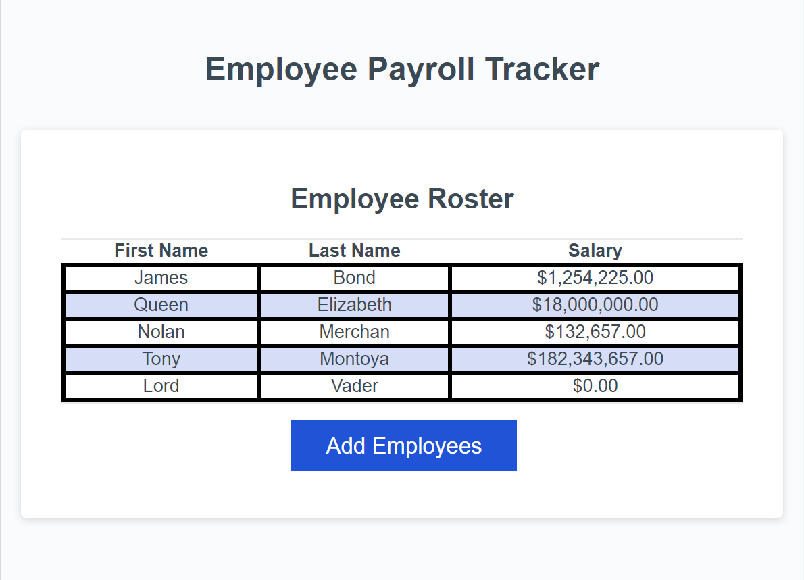
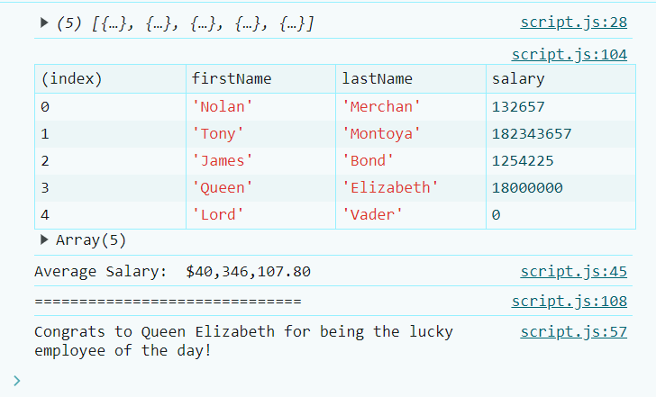

# Employee-Salary-Tracker README

Welcome to my Coding Portfolio! This repository showcases a collection of my projects, demonstrating my skills and expertise in various areas of software development. The portfolio is designed to be fully responsive, ensuring an optimal viewing experience on devices of all sizes, from mobile phones to large desktop monitors.

## Table of Contents

- [Introduction](#introduction)
- [Technologies Used](#technologies-used)
- [Live Deployment](#live-deployed-link)
- [License](#license)

## Introduction

The application takes input using prompts to create a list of employees along with their respective payroll information. The data is dynamically updated, allowing payroll managers to see the latest payroll details without needing to refresh the page. The user interface is designed to be responsive, ensuring an optimal viewing experience on devices of all sizes. CSS media queries and flexible layouts are used to adapt the design to different screen sizes, from mobile phones to large desktop monitors.

 
 

 
## Technologies Used

- HTML
- CSS
- JavaScript

## Live Deployed Link
https://drx-88.github.io/Employee-Salary-Tracker/
## Repository Link
https://github.com/DRX-88/Employee-Salary-Tracker

## License

This repository is licensed under the MIT License. See the [LICENSE](LICENSE) file for more information.

---

Thank you for visiting! I hope you find my project interesting.
